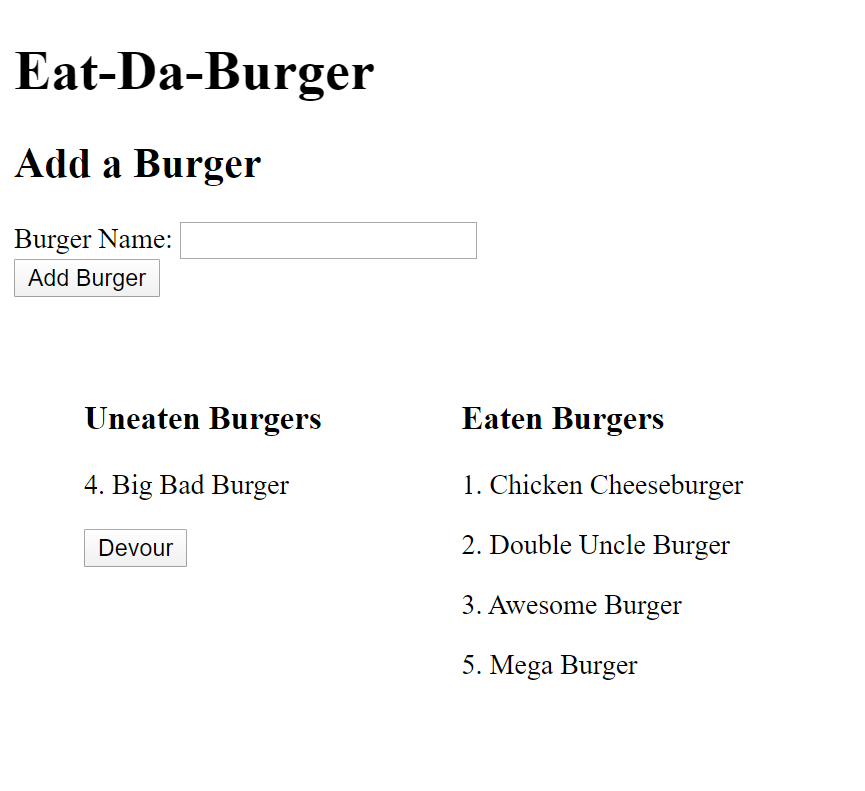

# Assignment 12: Burger Eating App

## A webapp demonstrating MVC and ORM concepts, built with Node.js and Handlebars, deployed to Heroku

A user can add a burger using the form. This creates a POST request, creating an entry in our JawsDB database. The burger instantly appears under the `uneaten` column along with its database ID.

Users can 'devour' burgers, flipping their `eaten` value from `false` to `true`, and moving it from the left to the right column. This uses the `eat()` method on our `Burger` model, which in turn uses the `updateOne()` method of our ORM.

## Live app: https://eat-da-burger-a12.herokuapp.com/
